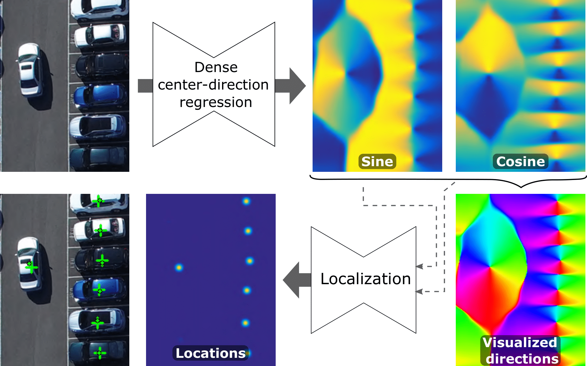

# CeDiRNet: Center Direction Regression Network

**[Visual Cognitive System Lab, ViCoS - UL, FRI - Ljubljana](https://vicos.si/research/)**


[Domen Tabernik](https://www.vicos.si/people/domen_tabernik/), [Jon Muhovič](https://www.vicos.si/people/jon_muhovic/), [Danije Skočaj](https://www.vicos.si/people/danijel_skocaj/)

[[`Paper`](https://doi.org/10.1016/j.patcog.2024.110540)] [[`Pre-print paper`](https://prints.vicos.si/publications/424/dense-center-direction-regression-for-object-counting-and-localization-with-point-supervision)]  [[`BibTeX`](#citation)]

## Citation

If using CeDiRNet please cite our paper using the following BibTeX entry:

```bibtex
@article{TabernikPR2024,
  title = {Dense center-direction regression for object counting and localization with point supervision},
  journal = {Pattern Recognition},
  volume = {153},
  pages = {110540},
  year = {2024},
  issn = {0031-3203},
  doi = {https://doi.org/10.1016/j.patcog.2024.110540},
  url = {https://www.sciencedirect.com/science/article/pii/S0031320324002917},
  author = {Domen Tabernik and Jon Muhovič and Danijel Skočaj}
}
```



## Installation

Dependency:
 * Python >= 3.6
 * PyTorch >= 1.9
 * [segmentation_models_pytorch](https://github.com/qubvel/segmentation_models.pytorch) 
 * opencv-python
 * numpy, scipy, scikit_image, scikit_learn

Recommended using Conda and installing dependencies as: 

```bash
conda create -n=CeDiRNet python=3.6
conda activate CeDiRNet
pip install -r requirements.txt
```

## Usage

Inference of images from folder:
```bash
python infer.py --input_folder /path/to/images --img_pattern "*.png" --output_folder out/ --config src/config/config_infer.json --model path/to/checkpoint.pth

# Usage: infer.py [-h] [--input_folder INPUT_FOLDER] [--img_pattern IMG_PATTERN]
#                 [--output_folder OUTPUT_FOLDER] [--config CONFIG]
#                 [--model MODEL] [--localization_model LOCALIZATION_MODEL]
# 
# Process a folder of images with CeDiRNet.
# 
# optional arguments:
#   -h, --help            show this help message and exit
#   --input_folder INPUT_FOLDER
#                         path to folder with input images
#   --img_pattern IMG_PATTERN
#                         pattern for input images
#   --output_folder OUTPUT_FOLDER
#                         path to output folder
#   --config CONFIG       path to config file
#   --model MODEL         path to model checkpoint file
#   --localization_model LOCALIZATION_MODEL
#                         (optional) path to localization model checkpoint file
#                         (will override one from model)
```

Training of the localization network from synthetic data:

```bash
export DATASET=synt-center-learn-weakly
export OUTPUT_DIR="../exp" # optionally provided path to output dir used in src/config/synthetic/train_center_learn_weakly.py (defaults to '../exp')
python train.py --config train_dataset.batch_size=64 \
                         train_dataset.hard_samples_size=32 \
                         num_gpus=1 \
                         display=True
```

For training/evaluation on dataset (e.g., PUCPR+) run:

```bash
export DATASET=PUCPRplus                    # defines which config to use (see src/config/__init__.py)
export CARPK_DIR="/path/to/CARPK_ROOT_DIR"  # path to where 'PUCPR+_devkit' folder is located (root of the CARPK dataset)
export OUTPUT_DIR="../exp"                  # optionally provided path to output dir used in src/config/PUCPRplus/*.py  (defaults to '../exp')

# training
python train.py --config num_gpus=1 \
                         train_dataset.batch_size=4 \
                         pretrained_center_model_path="path/to/localization_net/checkpoint.pth" \
                         display=True

# testing (with trained localization network)
python test.py --config train_settings.num_gpus=1 \
                        train_settings.train_dataset.batch_size=4 \
                        dataset.kwargs.type="test" display=False

# testing (with hand-crafted localization network)
python test.py --config train_settings.num_gpus=1 \
                        train_settings.train_dataset.batch_size=4 \
                        center_checkpoint_name="handcrafted_localization" \
                        center_checkpoint_path=None \
                        center_model.kwargs.use_learnable_nn=False \
                        dataset.kwargs.type="test" display=False
```
See config files in `src/config` for more details on configuration. Note, that using `--config` in command line will override settings from files.

By default, config files use 8 GPUs for dataset training with 32 or 128 batch size (depending on dataset), and 16 GPUs for localization net training with 768 batch size.

### Adding new dataset

You may add new dataset by providing config files and dataset class:
 * add dataset class to `src/datasets/NEW_DATASET.py` and update `src/datasets/__init__.py` 
 * add `train.py` and `test.py` config files to `src/config/NEW_DATASET` and update `src/config/__init__.py`

## Running experiments from paper

Scripts for running experiments related to the paper are in `scripts/EXPERIMENTS_*.sh`. Please edit the following configurations before first use:

 * input/output paths and Conda environment in `scripts/run_local.sh`
 * `SERVERS` env var in `scripts/EXPERIMENTS_*.sh` for distributed training (e.g, `SERVERS="serverA:0,1,2,3 serverB:2,3 serverC:1,0"`)
 * `GPU_LIST` env var in `scripts/EXPERIMENTS_*.sh` for parallel inference (e.g, `GPU_LIST=("serverA:0" "serverA:1" "serverB:0" "serverC:0")`) 

Note that changing the number of GPUs used may require updating the batch size and hard sample size in configuration files. 

Run experiments: 

```bash
# Run training of the localization network:
./EXPERIMENTS_TRAIN_LOCALIZATION.sh 

# Run training and evaluation on all datasets:
./EXPERIMENTS_MAIN.sh
```

By default, scripts will use run_distributed.sh that will delegate work to different GPUs on different servers (for testing) or will execute distributed training by running train.py on each server with the appropriate `WORLD_SIZE` and `RANK_OFFSET` env vars.

For running on single server, just use `localhost` for server name in `SERVERS` and `GPU_LIST`, or alternatively replace `run_distributed.sh` with `run_local.sh`.
